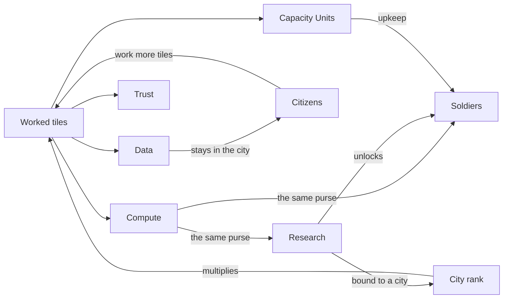

# The World of Fabric Empires

*How an exam outline became a country, and why every rule in it is an argument
about learning.*

This file is the story. It explains **why the game is shaped the way it is**,
and it is written so that somebody who has never opened it can follow along.
If you want to know how any of it was built and argued over, that is
[PLAN.md](PLAN.md); what does and does not ship with the source is
[NOTICE.md](NOTICE.md).

Every number below is taken from the engine rather than invented, and there is
a test that keeps it that way. Where the fiction and the mechanics do not yet
agree, this file says so out loud.

---

## The premise

You are not building an empire. You are building an **understanding**, and the
map is what your understanding looks like from above.

The tech tree is not *like* the DP-600 exam outline. It **is** the DP-600 exam
outline: 41 nodes, in seven clusters, in three branches, weighted exactly as
Microsoft publishes them. Researching a node means answering a real question
about it. Losing a battle means you did not know something, and the game says
which thing.

Everything else in this document follows from one design decision: **the
reward for knowing something must be paid in the currency the game is actually
played in.** Not points, not a badge, not a green tick. Land, citizens,
soldiers and walls.

---

## The four resources, and what each one is arguing

Read that loop once more, because it is the whole game. **Knowledge feeds the
economy, the economy feeds the army, and the army and the knowledge come out
of the same pocket.**

### Data — the local one

Data never leaves the city that produced it. It is not banked, it is not
spendable, and it does exactly one thing: **it makes citizens.**

A city needs `population + 1` Data a turn just to feed itself. Everything
above that accumulates, and when the pile reaches `10 + population × 8` a new
citizen is born. So the first citizen costs **18 Data**, the second 26, the
ninth 82. Growth gets harder as you grow, which is what stops one enormous
capital being the answer to everything.

Each citizen works one more tile inside the city's two-hex border, and every
worked tile produces more of everything. **More Data is more citizens is more
worked tiles is more of every other resource.** That is the engine of the
early game, and it is why a river tile, worth a flat `+1 Data`, is worth
founding a city beside.

> ⚠️ **The city will feed itself before it gets rich, and it had to be taught
> to.** An earlier version ranked tiles purely by value, which sent a hungry
> city straight for the nearest Capacity Unit vent: worth the most, feeds
> nobody. On one measured seed that produced a capital making 1 Data a turn
> against an 18 Data threshold, so its first citizen arrived on **turn 19**,
> and a city on pure highlands would have starved forever. Now, while a city
> is below subsistence, Data counts for triple when it picks tiles.

### Compute — the one that hurts

Compute is the empire's working currency, it pools across all your cities, and
it pays for **exactly two things**:

| | cost |
| --- | --- |
| Researching a topic | `weight × 6` Compute |
| Building a soldier | `24 + strength × 1.5` Compute |

A Pipeline Runner (strength 20) costs **54**. A Direct Lake Titan (strength
60) costs **114**. A single city may draw at most **15 Compute a turn** for
building, which is a deliberate brake: without it, production and research
fight over the same treasury and whichever is funded first takes all of it, so
a player who queued one unit would silently stop learning and conclude the
tech tree was broken.

**This is the central tension of the game and it is not an accident.** Every
Compute spent on a soldier is a Compute not spent on learning something. In a
game whose subject is studying, that is the trade worth having: a player who
ignores the tech tree to raise an army wins the battle and fails the exam.

### Capacity Units — the one that bites later

CU comes out of geothermal vents, three at a time, and it is the only resource
that can go **negative**. Every combat unit beyond your first three costs one
CU a turn to keep in the field.

Three free units is generous early and cruel at scale. An army of twelve costs
nine CU every single turn, forever, and if the treasury cannot pay it the
shortfall is clamped at zero and reported as bankruptcy rather than spiralling
into debt. (Debt spirals are hard to explain and this game is already asking
you to learn something else.)

The lesson is the one every capacity administrator learns: **the cost of a
thing is not what you paid for it, it is what it costs you every month
afterwards.**

### Trust — the honest gap

Trust is produced by Parquet Quarries (3), Semantic Peaks (2) and Delta
Highlands (1). It is granted 4 at a time for a council review answered
correctly. It is looted when a city is sacked. It is displayed in the resource
bar and banked in the treasury.

⚠️ **And nothing spends it.** Trust is currently a **score, not a currency**.
The Semantic Model city kind multiplies it by 1.6, tile selection values it as
highly as Data, and there is no sink at the other end. That is a real hole in
the design and it is listed here rather than papered over, because a story
that claimed Trust buys something would be a story that contradicts the game.

The fiction is ready for it whenever the mechanic arrives: Trust is what other
people's confidence in your numbers is worth, which is the thing a semantic
model actually sells.

---

## The land teaches by being walked on

Terrain names are the lesson. You learn that Delta tables sit above raw files
by **walking uphill from the plains into the highlands**.

| Terrain | Data | Compute | CU | Trust | Move | What it is |
| --- | --- | --- | --- | --- | --- | --- |
| **Raw File Plains** | 2 | | | | 1 | Easy ground, plentiful, unrefined. Where everybody starts |
| **Delta Highlands** | | 2 | | 1 | 2 | Harder to reach, worth the climb, +25% defence |
| **Parquet Quarry** | | | | 3 | 2 | You cut columns out of it. +25% defence |
| **CU Geothermal Vent** | | | 3 | | 1 | Raw capacity, straight out of the ground |
| **OneLake** | 1 | | | | 1 | Water. Everything drains into it |
| **Legacy Swamp** | 1 | | | | **3** | Passable. Slow. Cannot be settled |
| **Semantic Peaks** | | | | 2 | ∞ | Visible from everywhere, impassable, unsettleable |
| **Ungoverned Wastes** | | | | | 2 | Produces nothing at all |

Two of those are jokes with a point. **Legacy Swamp** yields as much Data as
open water and costs three times the movement to cross: you can get through
your legacy estate, it will just take you three times as long as you planned.
**Ungoverned Wastes** produce nothing whatsoever, which is what ungoverned
data does.

And **Semantic Peaks** cannot be settled or crossed. You can see them from the
whole map and you can never stand on them. A semantic model is not a place you
live; it is the thing everybody navigates by.

---

## A city says two things about itself

Every settlement has a **kind** (what it does) and a **rank** (how far it has
come). They compose, so a place reads "Lakehouse, Township" and both halves
mean something different.

### Kind — what it is for

| Kind | Base HP | Bias |
| --- | --- | --- |
| **Workspace** | 200 | ×1.2 on *everything* |
| **Warehouse** | 180 | ×1.4 Compute, ×1.2 Trust |
| **Lakehouse** | 140 | ×1.5 Data |
| **Semantic Model** | 130 | ×1.6 Trust |
| **Eventhouse** | 120 | ×1.3 Data, ×1.2 Compute |

The Workspace is the toughest thing you can build and the best all-rounder,
and it is deliberately best at nothing. The specialists are more fragile in
exact proportion to how specialised they are: the Eventhouse, which is the
fastest-moving thing on the map, has the thinnest walls of any city.

### Rank — and the part that makes this a study tool

| Rank | Citizens | Topics retained | At strength | Yield | Bonus HP |
| --- | --- | --- | --- | --- | --- |
| Settlement (*Siedlung*) | 1 | 0 | | ×1.00 | |
| Village (*Dorf*) | 2 | 1 | 0.30 | ×1.08 | +20 |
| Township (*Gemeinde*) | 4 | 2 | 0.60 | ×1.18 | +50 |
| Town (*Stadt*) | 6 | 3 | 0.60 | ×1.30 | +90 |
| **City** (*Großstadt*) | 9 | 4 | **0.95** | **×1.45** | **+140** |

⚠️ **Read the third column again.** A settlement cannot become a city by
eating. It must **hold on to what was built in it**.

Every city carries up to three *bound topics*: the subjects whose buildings
stand there. The spaced-repetition system already grades how well you have
retained each one, from 0 to 1, and a rank asks for a number of those topics
at a given strength. A Großstadt needs four topics retained at **0.95** — that
is not "you saw it once", that is "you still know it".

This is the single most important rule in the game, because it inverts the
usual 4X incentive. A town that grows purely on food rewards ending your turn
quickly. A town that grows on what you have actually retained rewards
**revising**. Only the second of those is why this project exists.

And it pays properly. A Großstadt collects **45% more** of everything than the
Siedlung it grew from, forever, and it is 140 hit points harder to take.

---

## The army comes out of the same purse as the knowledge

Twelve unit types. Each has an `unlockedBySkill` index into the tech tree, so
**the exam outline hands out your army**.

| Unit | Str | Move | Unlocked at node | |
| --- | --- | --- | --- | --- |
| Architect | 0 | 2 | — | Founds cities |
| Engineer | 0 | 2 | — | Improves tiles |
| Profiler | 8 | 3 | — | Sees 4 hexes |
| **RLS Sentinel** | 22 | 2 | **3** | Defensive, sees 3 |
| Lineage Hawk | 14 | 4 | 9 | Sees 5, ignores zone of control |
| Pipeline Runner | 20 | 2 | 14 | The line infantry |
| Shortcut Skiff | 12 | 4 | 16 | The only thing that crosses water |
| Notebook Cannon | 25 | 1 | 17 | Siege, sees 1 |
| Query Slinger | 18 | 2 | 27 | Strikes at range 2 |
| Semantic Colossus | 45 | 1 | 36 | Slow, enormous |
| Direct Lake Titan | 60 | 2 | 39 | The best unit in the game |
| **Refresh Guard** | 16 | 2 | **41** | The last node in the tree |

Four of those are arguments.

The **RLS Sentinel** unlocks at node **3**, which makes row-level security
almost the first thing you can build and the earliest real defence you get.
Security is not a late-game luxury in this world, and it is not one in the
exam either: governance is branch A, worth 25 to 30% of the paper.

The **Lineage Hawk** ignores zones of control, which means it walks straight
past armies that would pin anything else. Lineage goes where it likes; that is
the point of lineage.

The **Notebook Cannon** breaks cities and can see exactly **one hex**. It is
the most powerful siege weapon available and it is functionally blind. Anyone
who has run a notebook against production without looking at what it touches
knows why.

And the **Refresh Guard** is gated on node **41 of 41** — the very last thing
in the tree. The last thing you learn is how to keep everything else fresh,
which is either a joke about semantic model refresh or the most honest thing
in the game, depending on your week.

> ⚠️ A shorter curriculum than 41 nodes silently loses its late units: the
> unlock index simply never comes up, and nothing anywhere says why. If you
> import your own questions (the game lets you), a small tree means no Titan.

---

## In battle, the answer is the weapon

Strength and hit points decide a fight. Then the question lands on top of it.

Answering correctly is worth up to **±18 strength**, a total swing of 36. Set
that against the unit table and the design reveals itself:

- For a **Profiler** (strength 8), knowing the answer is worth more than the
  unit is. It is close to decisive.
- For a **Direct Lake Titan** (strength 60), it is worth about a third. It
  matters and it does not save you.

**Early on, knowing the answer is nearly everything. Later, a well-built army
survives being wrong.** That is the correct arc for a study tool: it should
carry you when you know nothing, and it should stop rescuing you once you have
built something real.

You get **14 seconds to think** in a battle, plus however long the question
takes to read, granted free at 200 words per minute. That reading allowance is
not generosity, it is a bug fix: the clock used to grade reading speed, and
only 3% of DP-600 questions could earn the bonus because the median question
needs 19.6 seconds just to read and choose.

Fortifying is worth +40% defence. Terrain is worth up to +25%. A siege unit
gets +75% against walls. Damage is capped at 100 and floored at 10, so no
attack is ever completely wasted and no city falls in a single blow.

---

## Your enemies are misconceptions

There are seven of them, and **not one is a competitor, a company, or a
person.** Each is a way of being wrong about data, and each quizzes you on one
cluster of the outline.

| Faction | Their seat | Cluster | The mistake they are |
| --- | --- | --- | --- |
| **The Open Gate** | Unbarred Yard | A1 — security & governance | Everything open to everyone, because it was easier |
| **The Untracked** | Tallyless | A2 — lifecycle | No source control, no deployment, no idea what changed |
| **The Silo Horde** | Silo Hold | B1 — get data | Every team with its own private copy |
| **The Denormalizers** | Wide Row | B2 — transform | Flatten it all, worry later |
| **The Scan Wraiths** | Full Sweep | B3 — query & analyse | Read every row, every time |
| **The Flat Table Cult** | One Great Table | C1 — build models | One enormous table instead of a model |
| **The Import Zealots** | Copy Landing | C2 — optimise models | Copy the data in, always, on principle |

⚠️ **Who is marching on you tells you what you are about to be tested on.**
Fighting on two fronts means revising two branches. This is not decoration: it
is the study planner. With only the Silo Horde in the game, six of the seven
clusters never tested the player at all, and the game quietly covered one
seventh of the exam.

They are named as misconceptions rather than products deliberately. The enemy
is never a vendor. The enemy is a habit.

---

## The choice the whole game is really about

When you break a rival's walls, you may do one of three things:

| | What you get | What it costs |
| --- | --- | --- |
| **Raid** | 12% of their stock, 12 damage | Repeatable, 4-turn cooldown, leaves them standing |
| **Raze** | **55%** of their stock, in one haul | The city is gone, and so is their cluster |
| **Capture** | The city, and **their cluster opens to you** | Slow, needs melee, and now you have to hold it |

Loot is `40 × population` scaled by the share, so a grown city is a real prize.
Razing is fast, final and **the tempting one on purpose**.

But capture is the only one of the three that teaches you anything. A player
who razes everything ends the game **rich, undefeated and narrow** — which is
precisely the failure mode of a real DP-600 candidate who has done the parts
they enjoy and burned the rest.

The loot is spent within ten turns. The cluster is knowledge you keep.

---

## The council: a bonus, never a punishment

When a bound topic falls due for review, the city holding it can convene a
council. Answer correctly and that city runs at **×1.25 on everything for five
turns**, and the empire gains 4 Trust.

⚠️ **An earlier version of this rule had overdue skills riot cities into
defecting.** Identical retrieval practice, opposite emotion — and the emotion
is the entire mechanic. "You neglected your homework, now suffer" is a reason
to stop playing. "There is a bonus sitting there for two minutes' work" is a
reason to review.

So the guard rails are absolute:

- Ignoring reviews costs yields and **nothing else**. Two are forgiven before a
  city even grumbles, unrest is hard-capped at 3, and the worst case is a 36%
  dampening. **No city can ever be lost to review debt.**
- **Nothing accrues while you are away.** Unrest is only ever computed inside a
  turn, and turns only advance when somebody is playing. Come back after a
  fortnight and you find a pile of *available bonuses*, not a burning empire.

That second rule is the difference between a study tool you return to and one
you avoid opening.

---

## The Proctor

At **80% exam readiness** — weighted by the published branch percentages, not
by how many topics you happen to have collected — something notices you.

The camera falls out of the sky onto your capital, and the Proctor arrives to
check. **40 questions**, in the published proportions, 45 seconds each. Pass
mark **70%**.

Every answer still feeds the review schedule. The siege is the hardest study
session in the game and it would be perverse for it to be the only one that
does not count.

There are three ways the game can end:

- **Domination** — every rival driven off the map. You beat all seven
  misconceptions.
- **Science** — the whole tree known. You learned everything.
- **The Exam** — you sat the paper and passed. This is the only victory the
  engine cannot compute, because it requires knowing what DP-600 *is*, and the
  engine is deliberately forbidden from knowing that.

Which is the correct ordering of victories for this game, and worth saying
plainly: **beating everyone is a victory, and passing is the point.**

---

## What this world does not do yet

Kept here so the story never gets ahead of the code:

- **Trust has no sink.** It is earned four ways and spent none. Today it is a
  score wearing a currency's clothes.
- **The Engineer improves tiles**, and tile improvement is thinner than the
  rest of the economy.
- **The seven factions all fight the same way.** The Flat Table Cult should
  arguably field one enormous unit and the Scan Wraiths should arguably be
  slow and everywhere; today they differ in what they *ask* you, not in how
  they *fight* you.
- **Razing leaves a ruin** and ruins currently do nothing but sit there.

---

## The whole thing in one paragraph

You land with a settler on ground you cannot see. You found a workspace beside
a river because rivers make Data and Data makes citizens, and every citizen
works another tile. The tiles pay you in Compute, and Compute is the only
thing that buys either a lesson or a soldier, so every unit you build is a
topic you did not learn. What you *do* learn gets bound to a city, and the
city grows into a town only if you still remember it a week later — at which
point it hands you 45% more of everything, forever. Meanwhile seven bad habits
are walking towards you across the map, and each one tests you on a different
quarter of the exam, so the direction of the threat tells you what to revise.
When you break one, you can burn it for a fortune or take it and learn what it
knew. Do that long enough and the Proctor comes down out of the sky to ask you
forty questions.

**Know things, and the map grows.**

---

*Every figure in this document was read out of the engine. If one of them ever
disagrees with the code, the code is right and this file is a bug.*
